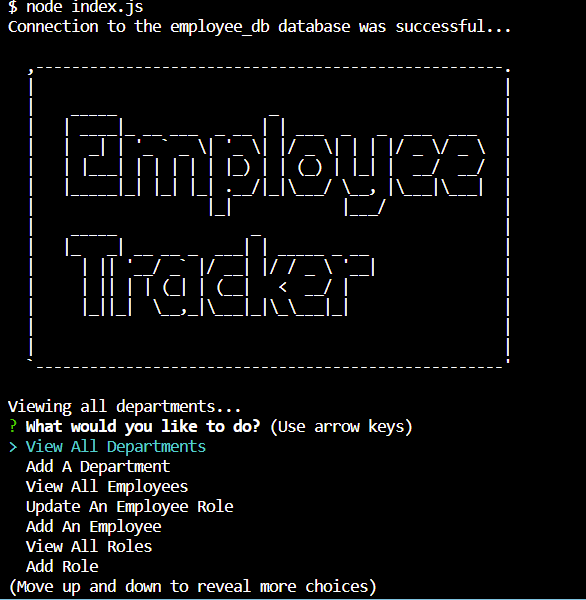

# employee-tracker

## Description
It is a command line function that uses node and MySQL2. It gets data from the database about the employees, their jobs and salaries as well. With this command line function, the data in the database can be modified.

## Screenshot

## Video of Walkthrough
https://watch.screencastify.com/v/z863UhwrNMakpK4JvLeA

## Installation
- Node
- MySQL2

## Usage
It runs with the command "node index.js."